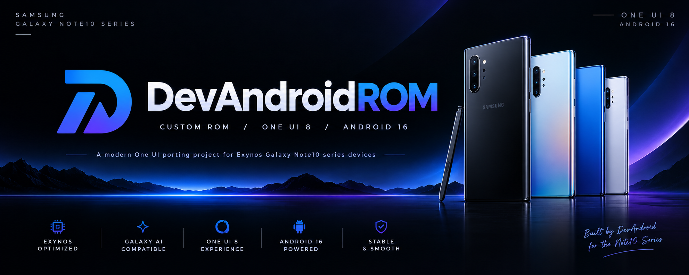

<h1 align="center">
  
</h1>

  
  

  <strong>DevAndroidROM</strong> is a work-in-progress Samsung One UI porting project for Exynos Galaxy Note10 series devices.

## Project scope

DevAndroidROM uses the [UN1CA] build system as its build-framework foundation. UN1CA provides the firmware acquisition, extraction, patch application, and flashable-package workflow used by the project.

The project is based on Samsung Galaxy S22 firmware and adapted specifically for the Exynos Galaxy Note10 series.

## Upstream lineage and porting references

DevAndroidROM was originally derived from and heavily modified from the Maniac-ROM project. While the project has since received extensive changes, Maniac-ROM remains an important part of its development history and upstream lineage.

The Galaxy Note10 adaptation additionally uses device-specific knowledge, configurations, patches, and porting experience from the EternityROM and ExtremeROM projects.

| Project | Role in DevAndroidROM |
|---|---|
| Maniac-ROM | Original project base and an important part of the project's upstream lineage. |
| UN1CA | Primary build system and firmware-to-package workflow. |
| EternityROM | Important Galaxy Note10-series porting reference, including device-specific configurations and patches. |
| ExtremeROM | Historical reference for device adaptation, porting practices, and project structure. |

> **Attribution notice:** These projects are credited as upstream references and sources of technical knowledge. Their respective authors, licenses, and repository terms remain applicable. This attribution does not imply endorsement, affiliation, or active maintenance by their maintainers.

## Supported devices

DevAndroidROM currently supports the following Exynos Galaxy Note10 series devices:

| Device | Codename | Model |
|---|---|---|
| Galaxy Note10 | `d1` | SM-N970F |
| Galaxy Note10 5G | `d1xks` | SM-N971N |
| Galaxy Note10+ | `d2s` | SM-N975F |
| Galaxy Note10+ 5G | `d2x` | SM-N976B |
| Galaxy Note10+ 5G | `d2xks` | SM-N976N |

> **Warning:** Only flash packages specifically built for your device codename. Flashing a package intended for another model may result in boot failure or data loss.

## Porting and build approach

DevAndroidROM maintains explicit target-device integration throughout the build process.

The project combines the selected Samsung source firmware with device-specific configurations and patches for:

- Device properties and feature configuration.
- Partition layout and storage handling.
- Display and resolution configuration.
- Framework and system application compatibility.
- CSC and regional configuration.
- Bluetooth compatibility.
- Hardware abstraction layer compatibility.
- Kernel and device-specific integration.
- Samsung service and feature compatibility.

## Features and integration

The available feature set depends on the selected target and source firmware.

Where supported by the active device configuration and patches, DevAndroidROM includes:

- Samsung One UI porting through the UN1CA build pipeline.
- Galaxy AI compatibility improvements where supported.
- Target-specific framework, application, CSC, and compatibility patches.
- Device-aware display and resolution handling.
- Device-specific partition handling.
- Bluetooth library compatibility integration.
- Samsung system feature compatibility patches.
- AppLock, Knox-related, signature, settings, and system behavior patches where applicable.
- Flashable ROM packages generated specifically for supported targets.

# Licensing

This project is licensed under the terms of the [GNU General Public License v3.0](LICENSE).

External dependencies may be distributed under different licenses, including:

- [android-tools](https://github.com/nmeum/android-tools), licensed under the [Apache License 2.0](https://github.com/nmeum/android-tools/blob/master/LICENSE)
- [apktool](https://github.com/iBotPeaches/Apktool), licensed under the [Apache License 2.0](https://github.com/iBotPeaches/Apktool/blob/master/LICENSE.md)
- [erofs-utils](https://github.com/sekaiacg/erofs-utils/), dual licensed under [GPL-2.0](https://github.com/sekaiacg/erofs-utils/blob/dev/LICENSES/GPL-2.0) and [Apache-2.0](https://github.com/sekaiacg/erofs-utils/blob/dev/LICENSES/Apache-2.0)
- [img2sdat](https://github.com/xpirt/img2sdat), licensed under the [MIT License](https://github.com/xpirt/img2sdat/blob/master/LICENSE)
- [platform_build](https://android.googlesource.com/platform/build/) (`ext4_utils`, `f2fs_utils`, `signapk`), licensed under the [Apache License 2.0](https://source.android.com/docs/setup/about/licenses)
- [smali](https://github.com/google/smali), distributed under multiple licenses

# Accountability

    #include <std_disclaimer.h>

    /*
    * Your warranty is now void.
    *
    * I am not responsible for bricked devices, dead SD cards,
    * thermonuclear war, or you getting fired because the alarm app failed.
    *
    * Please do your own research before making modifications to your device.
    * You are choosing to make these modifications yourself.
    *
    * I am also not responsible for any consequences resulting from the use
    * of features included in this ROM, including but not limited to Call
    * Recording or secure flag modifications.
    */

# Credits and acknowledgements

DevAndroidROM is built upon the work, knowledge, and development efforts of multiple projects and contributors.

The project was originally derived from Maniac-ROM, while UN1CA provides the underlying build system. Device-specific Galaxy Note10 porting knowledge and references were also obtained from projects such as EternityROM and ExtremeROM.

- **[salvogiangri](https://github.com/salvogiangri)** for the UN1CA build system, One UI patches, and general project support.
- **[ricci206](https://github.com/ricci206)** for Maniac-ROM and its contribution to the project's original foundation.
- **[Ocin4Ever](https://github.com/Ocin4ever)** and the EternityROM project for Galaxy Note10-series porting references, target-side configurations, and Exynos 9825 patches.
- **[ExtremeXT](https://github.com/ExtremeXT)** and the ExtremeROM project for historical porting references and engineering practices.
- **[Star-Seven](https://github.com/Star-Seven)** special thanks for the debugging and support. Without him, booting this ROM would not have been possible.
- **DevAndroid contributors and maintainers** for the continued development, adaptation, debugging, integration, and maintenance of DevAndroidROM.

Additional acknowledgements, inherited from the upstream Maniac-ROM development lineage:

- **[Igor](https://github.com/BotchedRPR)** for porting guidance and support.
- **[Halal Beef](https://github.com/halal-beef)** for lk3rd, testing, and miscellaneous help.
- **[Emad](https://github.com/emadhamid7)** for device-specific fixes.
- **[Duhan](https://github.com/duhansysl)** for vendor backports, fixes, and technical advice.
- **[Anan](https://github.com/ananjaser1211)** for contributions to Samsung One UI porting.
- **[PeterKnecht93](https://github.com/PeterKnecht93)** for smali assistance and miscellaneous fixes.
- **[tsn](https://github.com/tisenu100)** for smali fixes and advice.
- **[Nguyen Long](https://github.com/LumiPlayground)** for miscellaneous fixes and support.
- **[AlexFurina](https://github.com/AlexFurina)** for device-specific fixes.
- **[Luphaestus](https://github.com/Luphaestus)** for device-specific porting work.
- **[Yagzie](https://github.com/Yagzie)** for engmode and miscellaneous fixes.
- **[Fred](https://github.com/xfwdrev)** for WFD, HDR10+, audiopolicy, and other fixes.
- **[Saad](https://github.com/saadelasfur)** for build system assistance.
- **[Vince](https://github.com/borbelyvince)** for kernel upstream assistance.
- **Nhat Vo** for Google telemetry application removal.
- **[Code Malaya](https://github.com/jomiejoshiro)** for S Pen Air Actions.
- **[Renox](https://github.com/renoxtv)** for overlay patches and testing.
- **[Ksawlii](https://github.com/Ksawlii)** for build system updates and the FOD animation patch.
- **[nalz0](https://github.com/nalz0)** for Multi-User support.
- **[EndaDwagon](https://github.com/EndaDwagon)** for documentation development.
- **[Oskar](https://github.com/osrott61-gh)** for Odinpacks, builds, and documentation.
- **[Mesazane](https://github.com/Mesazane)** for build support.
- **Dupa** for extensive project assistance.
- **[RayShocker](https://github.com/RayShocker)** for the HRM fix.
- **[Szucsy92](https://github.com/Szucsy92)** for the Single Take fix.
- **[Kurt](https://github.com/kurtbahartr)** for ASCII art and minor fixes.
- Everyone who contributed to testing, documentation, translations, and development.

## Original UN1CA credits

- **[ShaDisNX255](https://github.com/ShaDisNX255)** for help, support, and the [NcX ROM](https://github.com/ShaDisNX255/NcX_Stock), which inspired the project.
- **[DavidArsene](https://github.com/DavidArsene)** for help and development support.
- **[paulowesll](https://github.com/paulowesll)** for help and support.
- **[Simon1511](https://github.com/Simon1511)** for support and device-specific patches.
- **[ananjaser1211](https://github.com/ananjaser1211)** for troubleshooting and development assistance.
- **iDrinkCoffee** and **[RisenID](https://github.com/RisenID)** for documentation revision.
- **[LineageOS](https://www.lineageos.org/)** for the original [OTA updater implementation](https://github.com/LineageOS/android_packages_apps_Updater).
- All UN1CA contributors and testers.

# Target configuration and kernel sources

Target-specific configurations are maintained in the corresponding `target/` directories for each supported device.

Kernel and device-tree sources must always be selected according to the exact device target and Android/One UI release being built. DevAndroidROM does not assume that a single kernel source can be used universally across all supported Galaxy Note10 variants.

## References

- **[UNICA](https://github.com/salvogiangri/UN1CA)**
- **[Maniac-ROM](https://github.com/ricci206/Maniac-ROM)**
- **[EternityROM](https://github.com/Ocin4ever/EternityROM/tree/fifteen)**
- **[ExtremeROM](https://github.com/ExtremeXT/ExtremeROM/tree/fifteen)**
